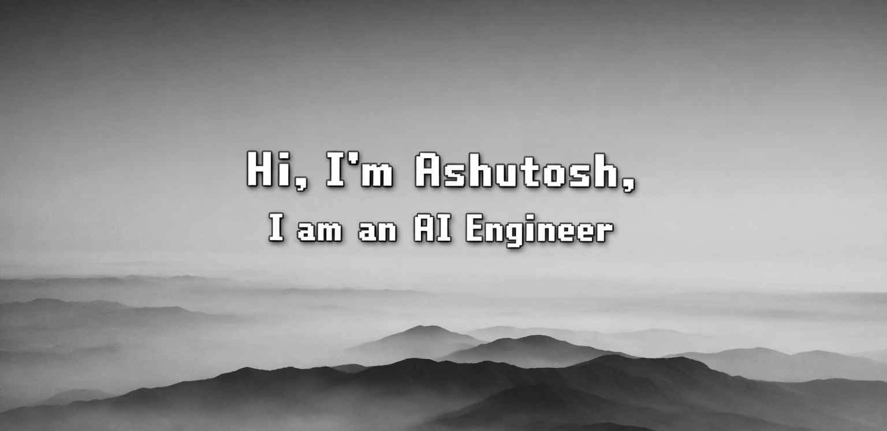

  

<h1 align="center">Ashutosh Dash</h1>

<h3 align="center">
AI & ML Engineer | Cybersecurity Researcher | Digital Forensics Enthusiast
</h3>

Designing secure, scalable, and intelligent systems integrating Machine Learning, Deep Learning, and Cybersecurity automation.

## About:

Artificial Intelligence and Computer Science Engineer with strong academic excellence (CGPA: 3.97/4.0) and hands-on research experience in Machine Learning–driven cybersecurity systems.

Focused on building robust authentication models, behavioral biometric systems, and automated threat monitoring architectures. Experienced in developing end-to-end ML pipelines, ensemble learning systems, and security-focused automation workflows designed for accuracy, resilience, and real-world deployment.

Research interests include AI-powered authentication, cyber threat detection, ensemble deep learning models, and intelligent system design.

## Tech Stack:

### Programming

  

### Machine Learning & Data Science

  

  
  

### Cybersecurity & Digital Forensics

  
  
  

### Tools & Development

  

  

## Contact

  
  

##  GitHub Stats

  

